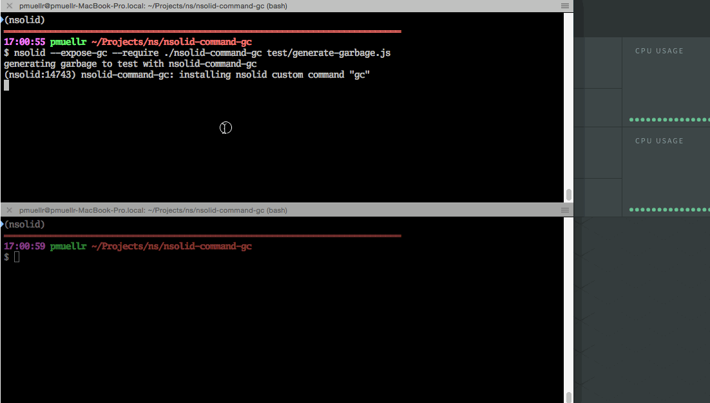

nsolid-command-gc - an N|Solid custom command to request garbage collection
================================================================================

This package provides an [N|Solid custom command][] to request garbage
collection for an N|Solid process.  After installing the custom command as an
npm package, you can then register the command in your app - when running
your app with the N|Solid Runtime, you'll be able to request garbage collection 
with the `nsolid-cli` tool.

For more information on N|Solid, visit the [N|Solid product page][].



Installation
================================================================================

    npm install nsolid-command-gc


Usage
================================================================================

Once you have installed the package, you can register the `gc` custom command within
your apps in one of two ways:

* Add `require('nsolid-command-gc')` somewhere in your application code

* Add the arguments `--require nsolid-command-gc` to your `nsolid` command
  invocation; the `--require` option is standard in modern versions of
  Node.js, including the N|Solid Runtime

The second option requires no changes to your code, so it obviously wins!

You will also need to use the Node.js `--expose-gc` option, which will add
a `gc()` function to the `global` object. This package uses this function to
request the garbage collection.

Once the `gc` custom command has been registered, garbage collection can be
requested for these apps with the `nsolid-cli` command, using the `custom`
subcommand with the `--name gc` option.

## Putting this all together:

Run your app with the `gc` custom command registered:

    nsolid --require nsolid-command-gc --expose-gc [other Node.js parameters]

Request garbage collection for that process, where `$AGENT_ID` is the agent id
for that process:

    nsolid-cli custom --id $AGENT_ID --name gc

By default, a 'full' garbage collection is requested. For a 'minor' garbage
collection, use the arguments `--data minor`, as in:

    nsolid-cli custom --id $AGENT_ID --name gc --data minor

The result of the `nsolid-cli custom` command is a line of JSON, that has a
`result` property as a top-level property.  The value of that property contains
two properties: `status` and `type`.  The `status` property indicates whether
the garbage collection was able to be requested.  The `type` property returns
`full` or `minor` depending on which type of garbage collection was requested.
For example:

    {
      "result": {
        "status": "OK",
        "type": "full"
        },
        "id": "<agent id>",
        "app": "<your app name>",
        "hostname": "<hostname>",
        "tags": ['<process tag', ...],
        "time": <time command was run>
      }

When the `gc` command is registered, and when it is invoked, the process it is
registered with will output messages to `stderr` via
[`process.emitWarning()`][process.emitWarning]†.  You can use Node.js
command-line options and event emitters on `process` to customize the behavior
of this method call.

† `process.emitWarning` is only available in N|Solid based on Node.js LTS 6.x Boron
and newer. Argon-based N|Solid releases will simply use `process.stderr`.


Example Usage
================================================================================

A sample is shipped with this package, in the `test` directory, named
`generate-garbage.js`.  This application generates and then orphans a lot of
references that need to be garbage collected. After letting it run for a few
seconds, and then using the `gc` custom command, you should see a drop in the
process's [`rss`][rss] memory value.  Hint: use the N|Solid Console to watch the
`rss` value drop in the process graphs.

Note that for this example, you will need to have the N|Solid Storage server
already running, and will probably want the N|Solid Console running as well.
For more information on installing and using the N|Solid Storage and Console
servers, see the [N|Solid documentation site][].

We'll assume you've already run `npm install nsolid-command-gc` for your
application, and that the package is available in
`node_modules/nsolid-command-gc`.

First, let's set some environment variables for N|Solid:

    export NSOLID_APPNAME=generate-garbage # the name of the N|Solid application
    export NSOLID_COMMAND=9001             # the command port of N|Solid Storage

Now run the test app with the `gc` custom command enabled:

    nsolid --require nsolid-command-gc --expose-gc node_modules/nsolid-command-gc/test/generate-garbage.js

You should see the following message in the output of the process, indicating
the custom command has been installed:

    (nsolid:$PID) nsolid-command-gc: installing nsolid custom command "gc"

By monitoring this process in the N|Solid Console, you can see memory usage
increasing.

To request a garbage collection, we first need to know the agent id of the
process.  You can see it in the URL from the N|Solid Console when viewing the
process details - it's a 40 character hex string that is a path element of the
page's URL.  Alternatively, you can get it from with the `nsolid-cli ls` command.  
Since the `nsolid-cli ls` command outputs a line of JSON for every N|Solid process, 
you probably want to have a nice JSON swiss army knife utility like [jq][] handy to
produce more readable output. Using `jq` and `grep` as filters, the following
command will print out the agent id of the `generate-garbage` application:

    nsolid-cli ls | grep generate-garbage | jq .id

Now, given the agent id, you can request garbage collection with the
command, where you would replace `$AGENT_ID` below with the actual agent id:

    nsolid-cli custom --id $AGENT_ID --name gc | jq

The nice looking output formated from `jq` will look like this:

```json
{
  "result": {
    "status": "OK",
    "type": "full"
  },
  "id": "a2827de4011e0b683c101aae7db5c37e9c62c5c7",
  "app": "generate-garbage",
  "hostname": "your-hostname-here",
  "tags": [],
  "time": 1484957897813
}
```

The process the command is sent to should also print the following message:

    (nsolid:$PID) nsolid-command-gc: requesting full garbage collection

You should notice the garbage collection visually in N|Solid Console, by a drop
in memory measurements in the graphs.


Contributing
================================================================================

To submit a bug report, please create an [issue at GitHub][].

If you'd like to contribute code to this project, please read the
[CONTRIBUTING.md][] document.


Authors and Contributors
================================================================================

<table><tbody>
  <tr>
    <th align="left">Patrick Mueller</th>
    <td><a href="https://github.com/pmuellr">GitHub/pmuellr</a></td>
    <td><a href="https://twitter.com/pmuellr">Twitter/@pmuellr</a></td>
  </tr>
</tbody></table>


License & Copyright
================================================================================

**nsolid-command-gc** is Copyright (c) 2017 NodeSource and licensed under the
MIT license. All rights not explicitly granted in the MIT license are reserved.
See the included [LICENSE.md][] file for more details.

[N|Solid product page]: https://nodesource.com/products/nsolid
[N|Solid documentation site]: https://docs.nodesource.com
[N|Solid custom command]: https://docs.nodesource.com/docs/custom-commands
[rss]: https://en.wikipedia.org/wiki/Resident_set_size
[jq]: https://stedolan.github.io/jq/
[issue at GitHub]: https://github.com/nodesource/nsolid-command-gc/issues
[CONTRIBUTING.md]: CONTRIBUTING.md
[LICENSE.md]: LICENSE.md
[process.emitWarning]: https://nodejs.org/dist/latest-v6.x/docs/api/process.html#process_event_warning
